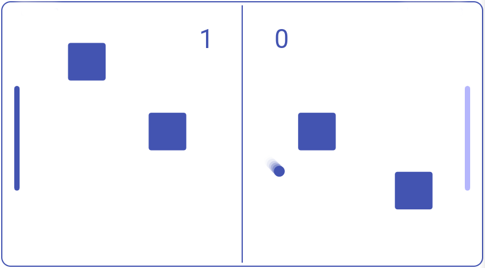

# ft_transcendence [](https://github.com/JaeSeoKim/badge42)


<p align="center">
  
</p>

## Description :

This project is the final projet of 42 cursus common core.

The goal of this project is to create online pong app, including :
 - a chat interface
 - a matchmaking system
 - a friendship relation system
 - notifications alert
 - 2fa with google authenticator
 - spectate mode
 - login with 42 api

Technologies used :
- docker
- node/nestjs
- react

Languages used :
- Typescript
- Bash
- Yaml

## Team : 

[Fred](https://profile.intra.42.fr/users/fle-blay), [Marius](https://profile.intra.42.fr/users/mbraets), [Jonathan](https://profile.intra.42.fr/users/jremy) 

## Usage :

Simply clone the git repository in the directory of your choice and run make.
the website will be available on http://localhost:8080 ! 

```
 	~/$> git clone https://github.com/jremy42/42-ft_transcendence.git
	~/$> cd 42-ft_transcendencen && Make
```

requirements : 
- Make
- Docker

compliant for deployement in aws => [you can try here](https://jremy.dev)
compliant for deployement in private webserver => [you can try here](https://leblay.dev/pong)

## Docker Stack :

<p align="center">
  
</p>


## Back Architecture :


## Front Architecture :


## What have we learned? :

## ressources:
