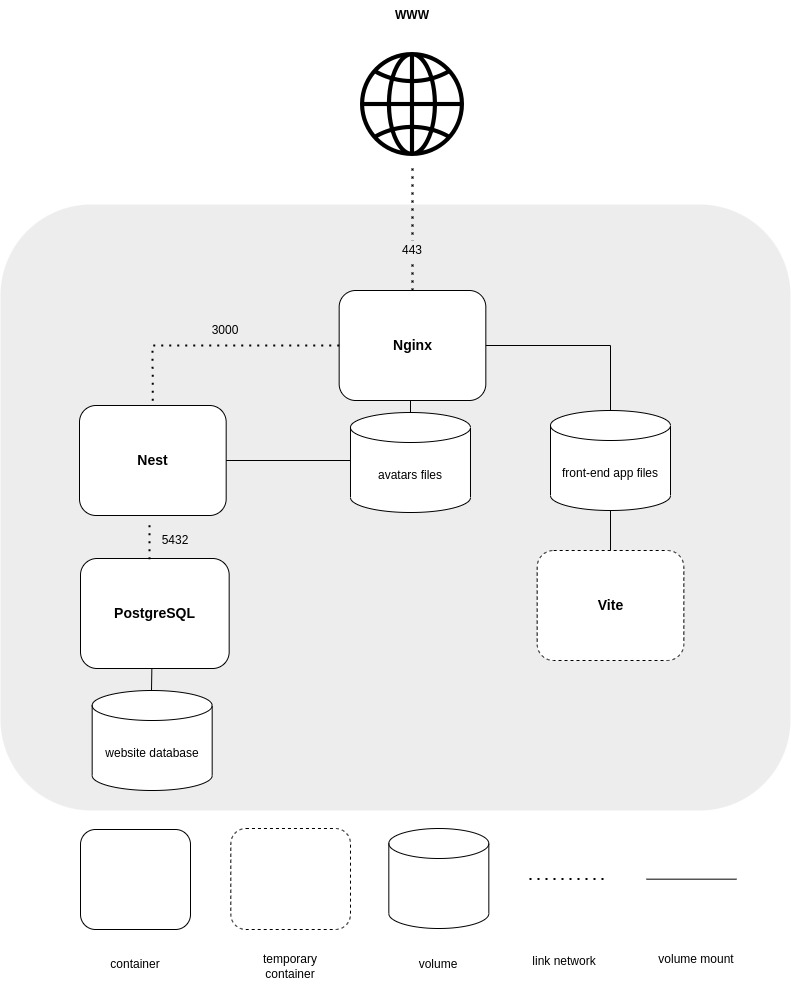
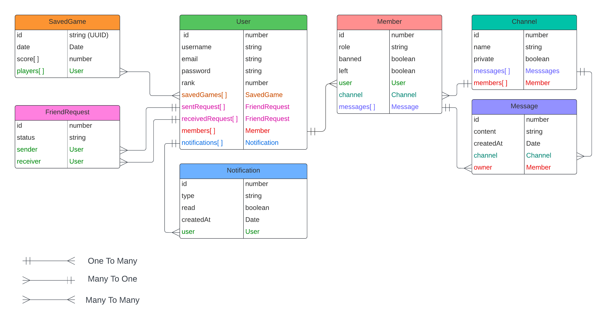

<div align="center">
<h1 align="center">

<br>
42-ft_transcendence <a href="https://github.com/JaeSeoKim/badge42"></a>


</h1>
<h3 align="center">📍 Welcome to the Web Devlopement !</h3>
<h3 align="center">⚙️ Developed with the software and tools below:</h3>

<p align="center">


</p>
</div>

## 📍 Overview

This project is the final projet of 42 cursus common core.

The ft_transcendence project involved creating a website for online multiplayer Pong gameplay. We implemented real-time gaming features, secure user authentication using OAuth, and a chat system for player communication.

---

## 💫 Features

- a chat interface
- a matchmaking system
- a friendship relation system
- notifications alert
- 2fa with google authenticator
- spectate mode
- login with 42 api

---


## 📂 Project Structure

<details closed>

```bash
repo
├── Makefile
├── README.md
├── backend
│   ├── Dockerfile
│   ├── launch.sh
│   ├── launch_test.sh
│   ├── nest-cli.json
│   ├── package-lock.json
│   ├── package.json
│   ├── src
│   │   ├── app.controller.spec.ts
│   │   ├── app.controller.ts
│   │   ├── app.middleware.ts
│   │   ├── app.module.ts
│   │   ├── app.service.ts
│   │   ├── chat
│   │   │   ├── ChatRequest.http
│   │   │   ├── chat.controller.spec.ts
│   │   │   ├── chat.controller.ts
│   │   │   ├── chat.module.ts
│   │   │   ├── chat.service.spec.ts
│   │   │   ├── chat.service.ts
│   │   │   └── dto
│   │   │       ├── change-channel.dto.ts
│   │   │       ├── create-channel.dto.ts
│   │   │       ├── join-channel.dto.ts
│   │   │       ├── modify-member.dto.ts
│   │   │       ├── mute.dto.ts
│   │   │       └── new-message.dto.ts
│   │   ├── events
│   │   │   ├── decorators
│   │   │   │   └── EventUser.decorator.ts
│   │   │   ├── dtos
│   │   │   │   ├── game-create.dto.ts
│   │   │   │   ├── game-join.dto.ts
│   │   │   │   └── player-input.dto.ts
│   │   │   ├── events.gateway.spec.ts
│   │   │   ├── events.gateway.ts
│   │   │   ├── events.module.ts
│   │   │   ├── guards
│   │   │   │   └── event.guard.ts
│   │   │   └── interceptors
│   │   │       └── WebSocketUser.interceptor.ts
│   │   ├── friends
│   │   │   ├── friends.controller.spec.ts
│   │   │   ├── friends.controller.ts
│   │   │   ├── friends.module.ts
│   │   │   ├── friends.service.spec.ts
│   │   │   └── friends.service.ts
│   │   ├── game
│   │   │   ├── game-cluster.ts
│   │   │   ├── game.controller.spec.ts
│   │   │   ├── game.controller.ts
│   │   │   ├── game.module.ts
│   │   │   ├── game.service.spec.ts
│   │   │   ├── game.service.ts
│   │   │   └── game.ts
│   │   ├── interceptors
│   │   │   └── serialize.interceptor.ts
│   │   ├── main.ts
│   │   ├── model
│   │   │   ├── channel.entity.ts
│   │   │   ├── friend-request.entity.ts
│   │   │   ├── member.entity.ts
│   │   │   ├── message.entity.ts
│   │   │   ├── notification.entity.ts
│   │   │   ├── refresh-token.entity.ts
│   │   │   ├── saved-game.entity.ts
│   │   │   ├── saved-game.subscriber.ts
│   │   │   └── user.entity.ts
│   │   ├── notification
│   │   │   ├── notification-request.subscriber.ts
│   │   │   ├── notification.controller.spec.ts
│   │   │   ├── notification.controller.ts
│   │   │   ├── notification.module.ts
│   │   │   ├── notification.service.spec.ts
│   │   │   ├── notification.service.ts
│   │   │   └── notification.subscriber.ts
│   │   ├── pipe
│   │   │   └── validateID.pipe.ts
│   │   ├── type.ts
│   │   ├── typeorm.filter.ts
│   │   ├── unauthorizedException.filter.ts
│   │   └── users
│   │       ├── auth
│   │       │   ├── auth.controller.spec.ts
│   │       │   ├── auth.controller.ts
│   │       │   ├── auth.module.ts
│   │       │   ├── auth.service.spec.ts
│   │       │   ├── auth.service.ts
│   │       │   ├── authenticated.guard.ts
│   │       │   └── hashPassword.ts
│   │       ├── decorators
│   │       │   └── current-user.decorator.ts
│   │       ├── dtos
│   │       │   ├── create-user.dto.ts
│   │       │   ├── dfa-code.dto.ts
│   │       │   ├── login-user.dto.ts
│   │       │   ├── request.http
│   │       │   ├── user-restricted.dto.ts
│   │       │   ├── user.dto.ts
│   │       │   └── username.dto.ts
│   │       ├── guard
│   │       │   ├── 2fa-token.guard.ts
│   │       │   ├── File-size.guard.ts
│   │       │   ├── access-token.guard.ts
│   │       │   └── refresh-token.guard.ts
│   │       ├── users.controller.spec.ts
│   │       ├── users.controller.ts
│   │       ├── users.module.ts
│   │       ├── users.service.spec.ts
│   │       └── users.service.ts
│   ├── test
│   │   ├── app.e2e-spec.ts
│   │   └── jest-e2e.json
│   ├── tsconfig.build.json
│   └── tsconfig.json
├── docker-compose.yml
├── envmaker.sh
├── info
│   ├── Diagramme sans nom.drawio
│   ├── GameArchitecture.drawio
│   ├── chat.drawio
│   ├── db_model.png
│   ├── stack_docker.drawio
│   └── stack_docker.jpg
├── jremy.conf
├── nginx
│   ├── Dockerfile
│   ├── avatars
│   │   ├── 1.png
│   │   └── default.png
│   └── nginx.conf
├── package-lock.json
├── package.json
└── vite
    ├── Dockerfile
    ├── index.html
    ├── launch.sh
    ├── package-lock.json
    ├── package.json
    ├── public
    │   └── pong.svg
    ├── src
    │   ├── App.tsx
    │   ├── ErrorProvider
    │   │   └── ErrorProvider.tsx
    │   ├── assets
    │   │   ├── private.png
    │   │   └── public.png
    │   ├── auth
    │   │   ├── AuthService.tsx
    │   │   └── interceptor.axios.tsx
    │   ├── component
    │   │   ├── 404.tsx
    │   │   ├── Debounced.tsx
    │   │   ├── DfaForm.css
    │   │   ├── DfaForm.tsx
    │   │   ├── Error.tsx
    │   │   ├── Footer.tsx
    │   │   ├── FriendList.tsx
    │   │   ├── InvitedFriends.tsx
    │   │   ├── Leaderboard.tsx
    │   │   ├── LoginForm.tsx
    │   │   ├── Menu.tsx
    │   │   ├── ProfilPlayer.tsx
    │   │   ├── RegisterForm.tsx
    │   │   ├── SearchBar.tsx
    │   │   ├── UpdateProfil.tsx
    │   │   ├── UserAchievment.tsx
    │   │   ├── UserInfoDisplay.tsx
    │   │   ├── UsernameDialog.tsx
    │   │   ├── chat
    │   │   │   ├── ChannelBrowse.tsx
    │   │   │   ├── ChannelMemberList.tsx
    │   │   │   ├── ChannelsList.tsx
    │   │   │   ├── ChatDirectMessageList.tsx
    │   │   │   ├── ChatFriendsBrowser.tsx
    │   │   │   ├── ChatMenu.tsx
    │   │   │   ├── ChatMessage.tsx
    │   │   │   ├── ChatPage.tsx
    │   │   │   ├── CreatChannelModal.tsx
    │   │   │   ├── MessageArea.tsx
    │   │   │   ├── ModifyChannelModal.tsx
    │   │   │   ├── MuteMemberModal.tsx
    │   │   │   └── PasswordDialog.tsx
    │   │   ├── game
    │   │   │   ├── CreateGame.tsx
    │   │   │   ├── FakeGame.tsx
    │   │   │   ├── FinishGames.tsx
    │   │   │   ├── GameHistory.tsx
    │   │   │   ├── GamePage.tsx
    │   │   │   ├── GameScreen.tsx
    │   │   │   ├── ListCurrentGames.tsx
    │   │   │   └── ResultGame.tsx
    │   │   └── notifications
    │   │       ├── notifcationsBar.tsx
    │   │       ├── notificationDirectMessage.tsx
    │   │       ├── notificationInvitation.tsx
    │   │       ├── notificationRequestFriend.tsx
    │   │       └── notificationsList.tsx
    │   ├── index.css
    │   ├── main.tsx
    │   ├── socket
    │   │   └── SocketProvider.tsx
    │   ├── token
    │   │   └── token.tsx
    │   ├── types.tsx
    │   ├── userDataProvider
    │   │   └── userDataProvider.tsx
    │   └── vite-env.d.ts
    ├── tsconfig.json
    ├── tsconfig.node.json
    └── vite.config.ts

38 directories, 177 files
```

</details>

## 🚀 Getting Started

### ✅ Prerequisites

Before you begin, ensure that you have the following prerequisites installed:
   
   - docker

### 🖥 Installation

1. Clone the 42-ft_transcendence repository:
```sh
git clone https://github.com/jremy42/42-ft_transcendence
```

2. Change to the project directory:
```sh
cd 42-ft_transcendence
```

3. launch application:
```sh
make
```

4. for normal usage : 
http://localhost:8080

### 🚀 Deployment Instructions

To deploy the application on your own URL, please follow these steps:

1. Set the URL in the PUBLIC_URL field to your desired URL in .env file.
2. Make sure to provide the necessary environment variables for the application to function properly.

To integrate the application with the 42 API, please ensure you have the following environment variables properly configured:

```sh
API_CLIENT_ID=
API_CLIENT_SECRET=
```

Compliant for deployement in aws => [you can try here](https://transcendence.jremy.dev)

Compliant for deployement in private webserver => [you can try here](https://leblay.dev/pong)

---
### 🤖 Stack docker

<p align="center">
  
</p>

#### Nginx :
- ingress point listening on 443 with ssl
- reverse proxy for nestjs backend api calls
- static serve of avatars files (.png) and front-end app file (.js / .html / .css) 

#### Vite :
- Transpilation and minification from typescript to javascript
- exits on success

#### Nest :
- expose api routes for use in frontend
- serves as an intermidary between client and postgre Database

#### PostgreSQL :
- handle CRUD operations on website database
---
### 🗄️ Data Architecture 

<p align="center">
  
</p>


## 👏 Acquired knowledge

- ✅  Web development: We gained experience in web development by creating a website .

- ✅  Backend with NestJS: We learned to develop the backend of our website using NestJS, a powerful Node.js framework that helps with building scalable and efficient server-side applications.

- ✅  Frontend with React and TypeScript: We utilized React, a popular JavaScript library for building user interfaces, and leveraged TypeScript, a statically-typed superset of JavaScript, to develop the frontend of our website. This allowed for component-based development, better UI management, and enhanced type safety.

- ✅  Real-time multiplayer functionality: We implemented real-time multiplayer features, enabling users to play Pong with each other in real-time through our website, We used Socket.IO, a JavaScript library, to enable real-time communication and data exchange between the server and clients.

- ✅ User authentication with OAuth and tokens: We implemented an authentication strategy using OAuth and utilized refresh and access tokens for secure user authentication and authorization. Also, We integrated the OAuth system from the 42 intranet, allowing users to log in securely using their 42 credentials.

- ✅  Chat functionality: We created a chat feature where users can send direct messages to each other, enhancing the interactive experience of our website.

- ✅  Docker: We utilized Docker to create a containerized environment for our application, allowing for easy setup and deployment across different systems.

- ✅  PostgreSQL: We used PostgreSQL, an open-source relational database management system, to store and manage our application's data effectively.

- ✅  Online deployment on a server: We deployed our website online on a server, making it accessible to users over the internet. This involved configuring the server, setting up the necessary dependencies, and deploying our application to ensure it is available for use.


## 😎 Team :

[Fred](https://profile.intra.42.fr/users/fle-blay), [Marius](https://profile.intra.42.fr/users/mbraets), [Jonathan](https://profile.intra.42.fr/users/jremy) 
---
